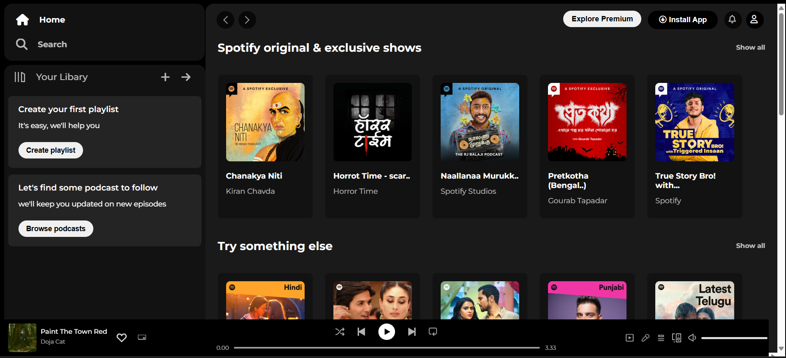

# 🎧 Spotify Clone 

This project is a **static clone of Spotify's web interface**, recreated using just **HTML and CSS** — no JavaScript or frameworks involved.

It replicates the UI of the Spotify homepage including the sidebar, navigation bar, playlists, cards, and footer music player layout.

---

## 📸 Screenshot

---

## 🔍 Features

- Sidebar with Home, Search, and Library options
- Section for creating playlists and browsing podcasts
- Responsive card layout for featured podcasts and albums
- Top navigation bar with profile and app buttons
- Footer player bar (UI only, no functionality)

---

## 🛠️ Tech Stack

- ✅ HTML5
- ✅ CSS3 (Flexbox & Grid layout)
